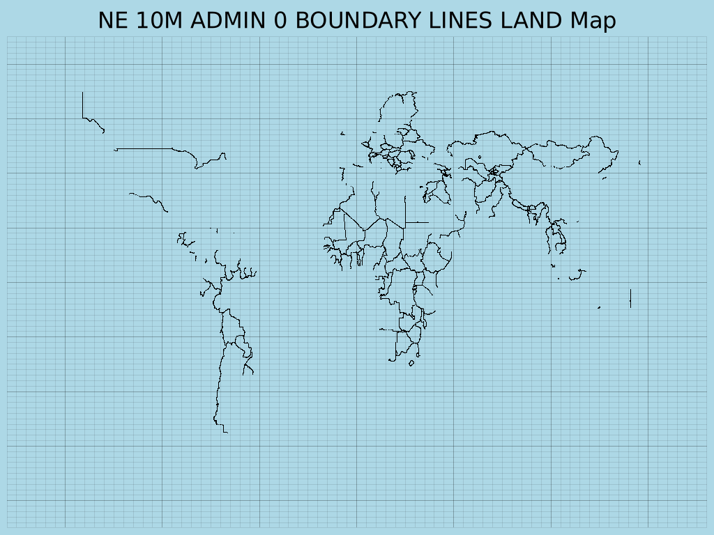
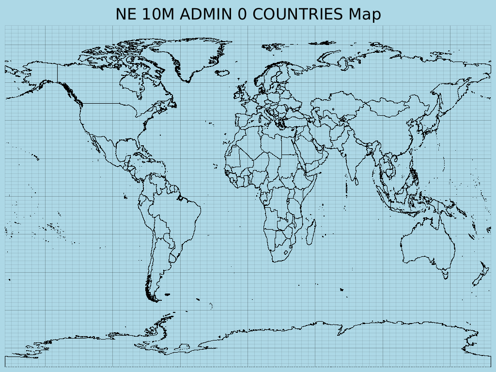
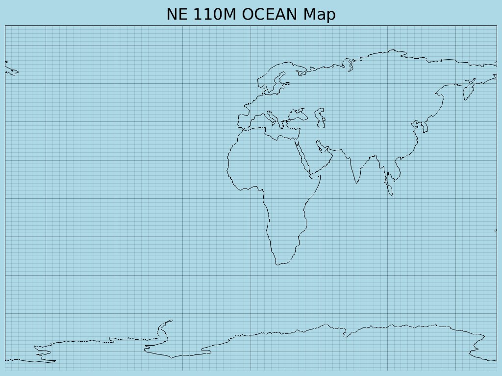
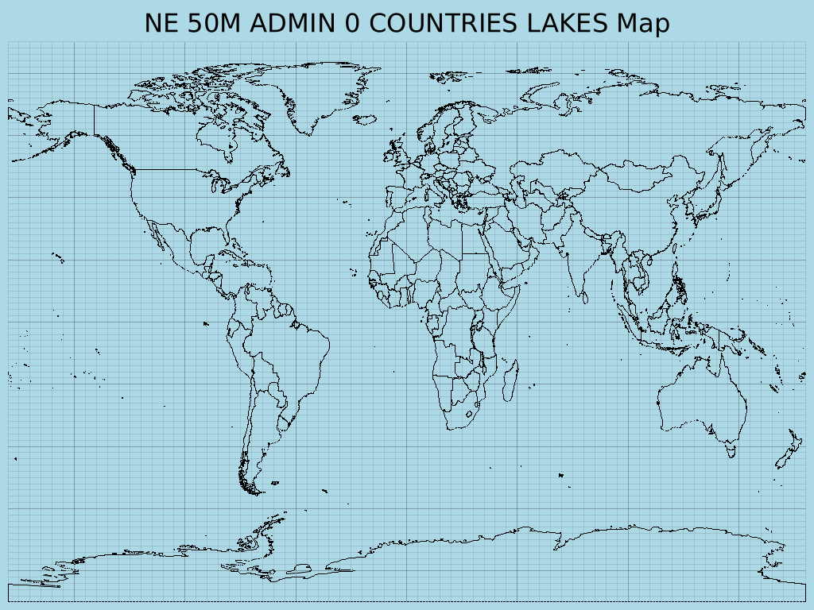

# Rust World Map Plotter

This repository contains a Rust application designed to visualize world coastlines. It leverages the `plotters` library for generating image output and the `geojson` crate for parsing geographical data from GeoJSON files. It's built to demonstrate basic geographical plotting in Rust.

## Features

- Reads world coastline data from a standard GeoJSON file.
- Plots coastlines on a 2D Cartesian chart, representing longitude and latitude.
- Generates a PNG image of the world map.
- Configurable map title and margins.
- Basic error handling for GeoJSON file operations.

# GeoJSON Mapper Output Examples

Here are some example maps generated by the Rust GeoJSON Mapper:

<table style="width:100%; border: none;">
  <tr>
    <td style="text-align: center; padding: 10px;" colspan="2"></td>
  </tr>
  <tr>
    <td style="text-align: center; padding: 5px;"></td>
    <td style="text-align: center; padding: 5px;"></td>
  </tr>
  <tr>
    <td style="text-align: center; padding: 5px;"></td>
    <td style="text-align: center; padding: 5px;"></td>
  </tr>
</table>

## Prerequisites

Before you begin, ensure you have the following installed:

- **Rust and Cargo:** You can install them by following the instructions on [rust-lang.org](https://www.rust-lang.org/tools/install).

### System Dependencies

This project uses the `proj-sys` crate, which is a low-level binding to the PROJ C library. You will need to install PROJ development files and a C/C++ compiler on your system.

**For Debian/Ubuntu-based systems (e.g., Pop!\_OS):**

```bash
sudo apt update
sudo apt install build-essential libproj-dev proj-bin clang libclang-dev
```

For other operating systems, please refer to the `proj-sys` crate documentation or your system's package manager for equivalent packages.

## Setup and Usage

Follow these steps to get the project running and generate your world map:

1. Clone the repository:

   ```bash
   git clone https://github.com/Harshit-Dhanwalkar/rust-geojson-mapper.git
   cd rust-geojson-mapper
   ```

2. Download GeoJSON Data:
   This application requires GeoJSON data to plot. You can obtain a collection of world geographical data from the Natural Earth project.
   Download the geojson.zip file directly from the geojson directory of the natural-earth-vector repository:
   `https://github.com/nvkelso/natural-earth-vector/tree/master/geojson`

   After downloading, extract the contents of geojson.zip into a new directory named data/geojson/ in the root of this project.

3. Build and Run:
   Navigate to the project's root directory (rust-geojson-mapper/) and execute:

   ```bash
    cargo build
    cargo run
   ```

   This command will compile the project and then run the executable. The application will then list available GeoJSON files and prompt you to choose one to plot. Generated `.png` image files will be saved in the `output/` directory.

## Data Source Acknowledgement

The GeoJSON data used in this project is sourced from the Natural Earth project, specifically from the repository maintained by [nvkelso](https://github.com/nvkelso).

---

### FIXES

- [ ] Scroll with circling back to first when reached the bottom of list.
- [ ] Resize layout.

# License

This project is open-source and available under the [MIT License](LICENSE).
